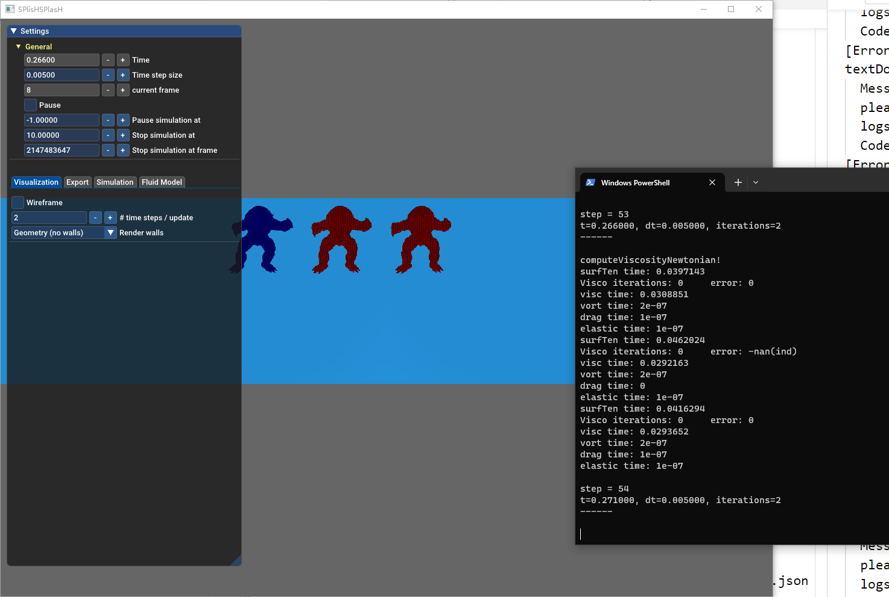

# NonNewton Code
This is the code of 2023 TVCG paper entitled
"A Unified Particle-Based Solver for non-Newtonian Behaviors Simulation".

Authors: Chunlei Li, Yang Gao , Jiayi He, Tianwei Cheng, Shuai Li, Aimin Hao, Hong Qin

System: Windows 10

arxiv: [https://arxiv.org/abs/2312.04814](https://arxiv.org/abs/2312.04814)

DOI: [10.1109/TVCG.2023.3341453](https://ieeexplore.ieee.org/document/10354362)

Latex and presentation: [https://github.com/chunleili/nonNewtonPaper](https://github.com/chunleili/nonNewtonPaper)

## Automactic scripts for replication

You **only need** to run the `auto.py` if you want to verify the replicability.

```
python auto.py
```

It will generate the results of Honey case(Fig.8).

---
The following sections **are for those who want to fully reproduce** the paper's reuslts.

## Install
Requirements:
- Visual Studio 2022
- VS Code
- cmake 3.25

Follow the steps:
1. config
```
cmake --preset vs2022
```
2. build
```
cmake --build --preset vs2022-Rel
```

## Run and replicate the scenes in the paper

Suppose you are in project directory.

1. Armadillo scene(Fig.14)
```
./bin/SPHSimulator --scene-file ../data/MyScenes/ramp1.json --no-initial-pause
```

A visualizer will prompt out. Use mouse wheel to scale up and down. Use middle button to pan.



2. Honey scene(Fig.8)
```
./bin/SPHSimulator --scene-file ../data/MyScenes/strawberry_honey.json --no-initial-pause
```

3. Cut melting bunny scene(Fig.9)

```
./bin/SPHSimulator --scene-file ../data/MyScenes/hotcut.json --no-initial-pause
```

4. Ice cream scene(Fig.10)

```
./bin/SPHSimulator --scene-file ../data/MyScenes/ice-cream.json --no-initial-pause
```

5. Cow scene(Fig.7)

```
./bin/SPHSimulator --scene-file ../data/MyScenes/cow.json --no-initial-pause
```

6. Golf falls into cornstarch-water mixture scene(Fig.12)

```
./bin/SPHSimulator --scene-file ../data/MyScenes/bowl2.json --no-initial-pause
```

7. Ketchup scene(Fig.13)

```
./bin/SPHSimulator --scene-file ../data/MyScenes/bowl_ketchup.json --no-initial-pause
```

## Rendering(Optional)

Because the rendering using houdini involves non-free CG assets and softwares, the authors are **not responsible for any questions** in replicating the rendering results.

Output files locate in **./bin/<scene_name>/mypartio/**. Load them with Houdini 19.5 for rendering.

The Houdini hip files locate in data/Houdini_scenes

## Note
Some may encounter the compiling issues when using the latest vs2022(version 17.8.3), which are related to partio and antTweakBar. But do not worry about that,  these will not interfere with the normal running of the code.

## Extra
This code is based on the Jan Bender's: https://github.com/InteractiveComputerGraphics/SPlisHSPlasH 
